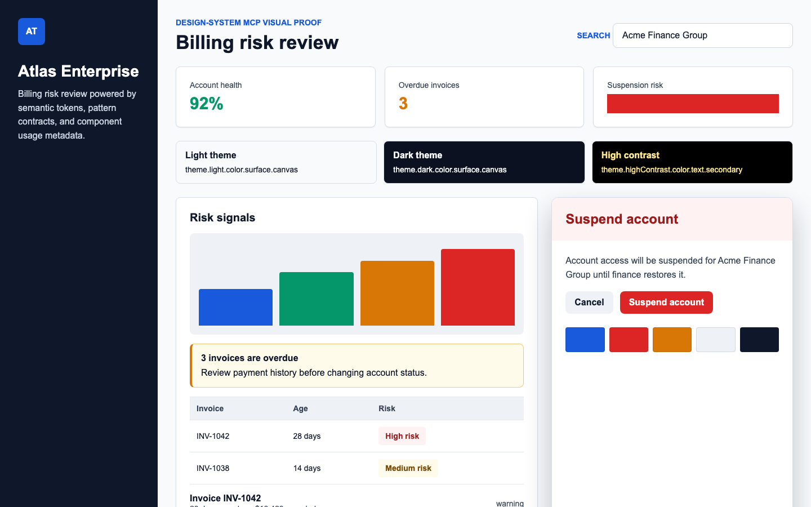

# Atlas Enterprise Design System Sample

This repository is a complete sample source repo for `design-system-mcp`.



It intentionally exercises every major ingestion path:

- `manifest.json` with explicit content types and relations
- DTCG token JSON under `tokens/*.tokens.json`
- community Markdown / `getdesign.md` token frontmatter
- principles, patterns, conventions, and voice guidance
- component metadata under `components/*/component.json`
- TypeScript prop extraction from `*.tsx`
- Storybook CSF example extraction from `*.stories.tsx`
- MCP prompt templates under `prompts/*.prompt.md`
- regex and AST-backed validation rules under `rules/*.json`

The sample is fictional. It models a B2B analytics console with dense data, cautious actions, and high accessibility expectations.

## Expected MCP Flow

1. Read `design://workflow` or call `describe_schema`.
2. Run `inspect_coverage` with the `enterprise` profile.
3. Use `recommend_composition` for a UI intent such as `Create a billing risk review page`.
4. Use `get_usage` for selected components.
5. Resolve every required token with `resolve_token`.
6. Validate the planned components with `validate_composition`.
7. Generate UI.
8. Run `validate_ui`, repair deterministic issues, and validate again.

## Good Test Intent

```text
Build a responsive billing risk review page for finance operators.
It should show account health, invoice risk, a search field, a warning alert,
and a destructive suspend-account confirmation path.
```

This intent should involve:

- `pattern:billing-risk-review`
- `pattern:risk-dashboard`
- `pattern:destructive-confirmation`
- `component:theme-provider`
- `component:card`
- `component:button`
- `component:text-field`
- `component:alert`
- `component:modal`
- `component:data-table`
- `component:chart`
- `component:badge`
- semantic color, spacing, typography, radius, and shadow tokens
- multi-theme, density, state, data-viz, motion, elevation, layer, breakpoint, and platform tokens

## Negative Validation Ideas

Use these snippets to confirm that MCP validation catches drift:

```tsx
<Button variant="ghost">Submit</Button>
```

Expected:

- invalid AST prop value from `rules/no-button-ghost-variant.json`
- copy warning from built-in vague action label checks

```tsx
<section style={{ color: "#185ADB", padding: "24px" }}>
  
</section>
```

Expected:

- raw color violation
- raw length violation
- missing image alt violation

For destructive modal semantics, use `validate_composition` with `pattern:destructive-confirmation`; the pattern contract requires `role: "alertdialog"` only in that context.
